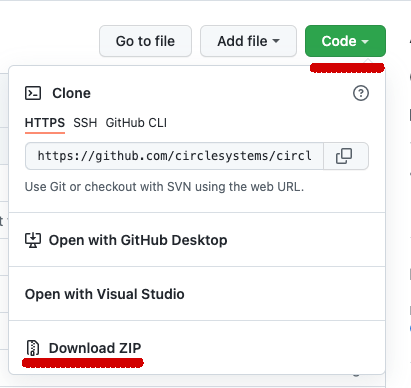
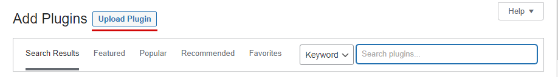
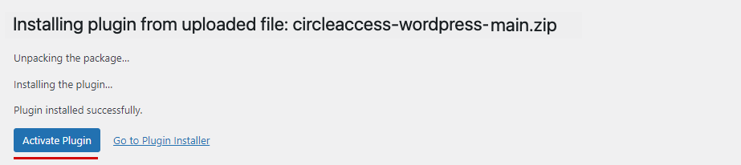
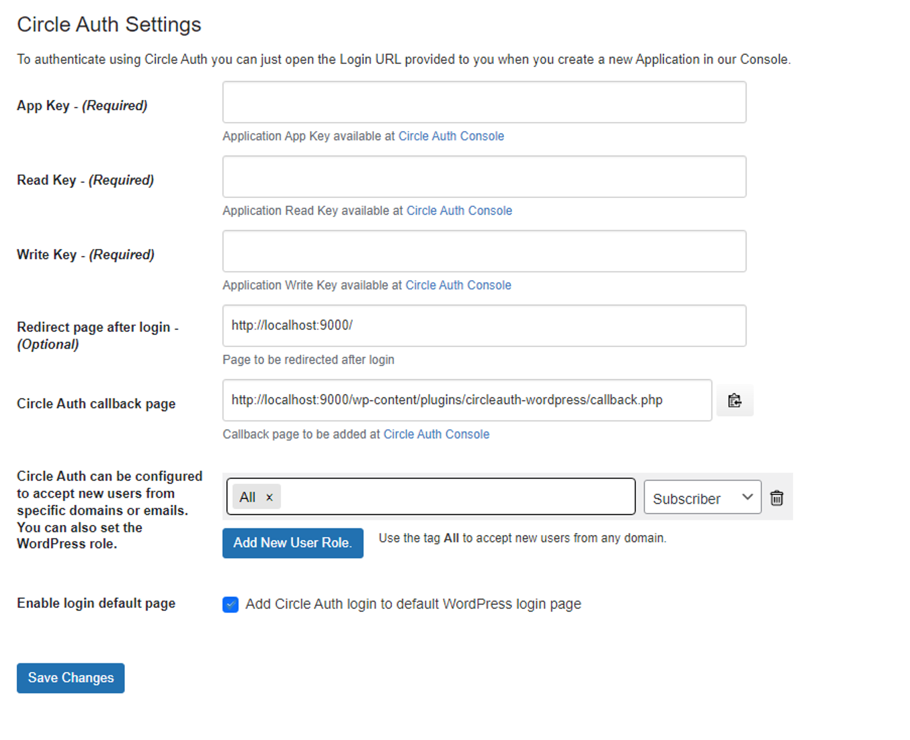
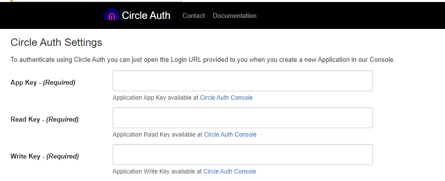
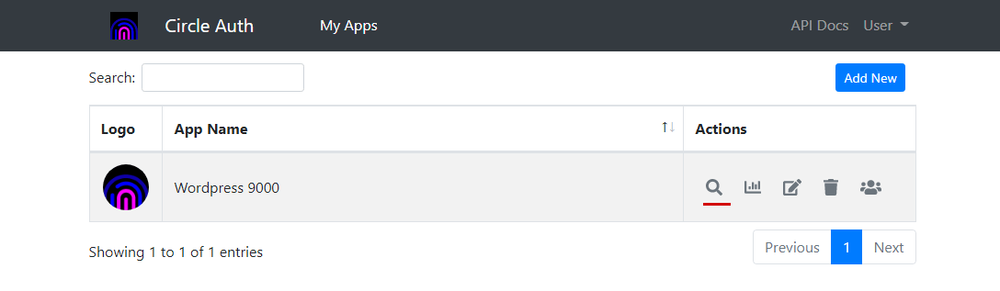
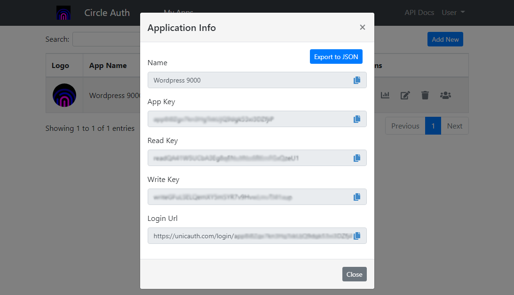
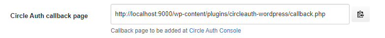
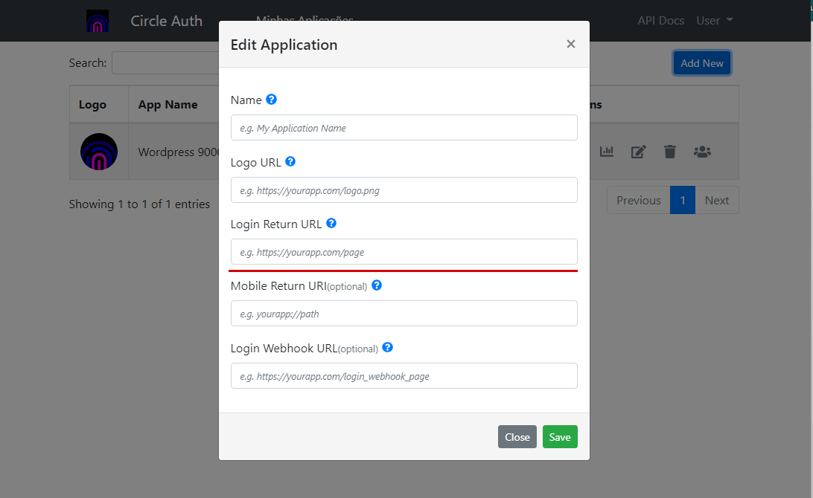
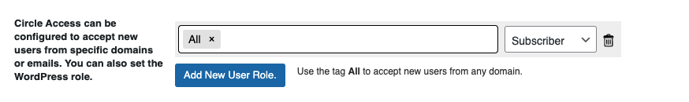

# Circle Auth
Circle Auth provides Continuous Authentication, Authorization API, Codeless 2FA, Credential-less Authentication , modules and apps to make the user access secure and easy.

# CircleAuth WordPress plugin

## Installation

### 1) Download the zip file

Go to the GitHub https://github.com/circlesystems/circleauth-wordpress, click on the "Code" button and select the "Download ZIP" option.

### 2) Go to “Plugins” on your WordPress dashboard

 

Once you have your ZIP file, go back to your WordPress wp-admin panel, click on “Plugins” on the sidebar menu, and then on the “Add New” button.

### 3) Upload your plugin archive

From there, click on the “Upload Plugin” button visible at the top:

On the next screen, you will be able to upload your plugin’s ZIP file straight to your WordPress. Just select the ZIP from your computer and confirm the upload by clicking on “Install Now.”

### 4) Activate the plugin

After doing so, the plugin is online and you can start using it.

 
## Configuration

To start using the plugin, some configurations are needed. 

 

### 1. App Key, Read Key and Write Key. 

You can retrieve the keys from the Circle Auth console (https://console.gocircle.ai/).
In this example, we register WordPress as an application named "WordPress 9000".
(Our WordPress runs locally on port 9000).
 

 

### 2. Redirect page after login

Optionally, you can register a page to which the user will be redirected after login.

### 3. Circle Auth callback page

This URL is used when registering the application on Circle Auth console.

### 4. Domains and e-mails

Circle Auth can be configured to only accept logins from specific domains or emails.
For example, you can specify that only logins whose email domain is the company's domain are accepted.
It is also possible to configure by domain or email what role the new user should take in WordPress. This rule is only available for users who are not yet registered with WordPress.

### 5. Enable login default page

When this option is enabled, the Circle Auth login button is added to the default WordPress login page.

